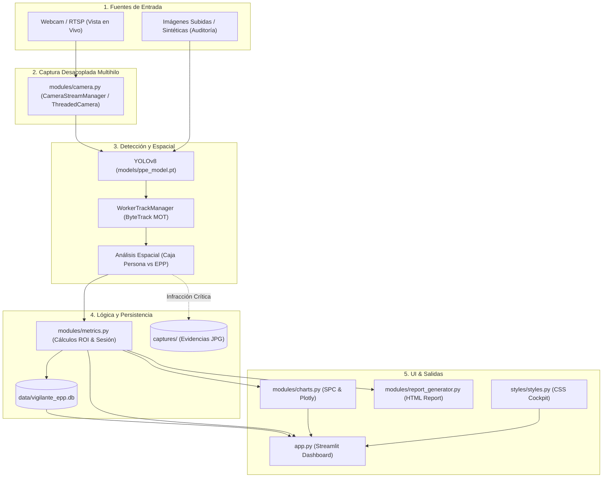

# 🗺️ PROJECT MAP — Vigilante EPP (SafeGuard AI)
> **Índice de Contexto Rápido para Agentes y Desarrolladores**  
> *Consulte este archivo al inicio de una sesión para ubicar arquitectura, módulos y flujos sin re-escanear todo el código.*

---

## 📌 1. Visión General & Propósito
**Vigilante EPP** es una aplicación de visión artificial para la supervisión y auditoría en tiempo real del uso de Equipo de Protección Personal (casco, chaleco reflectante) en plantas industriales y obras.

* **Modo de Operación:** 100% Local / Offline.
* **Interfaz de Usuario:** Dashboard interactivo en Streamlit dividido en 3 pestañas:
  1. `📹 Vista en Vivo`: Monitoreo en directo por webcam/RTSP con tracking multi-operario (ByteTrack), HUD semafórico y registro automático de infracciones.
  2. `🖼️ Auditoría de Imágenes`: Auditoría forense de fotografías subidas o sintéticas con comparador visual e informe de cumplimiento.
  3. `📊 ROI y Métricas`: Panel gerencial con KPIs, gráficos de control estadístico (SPC Shewhart Run Chart), distribución de riesgo, calculadora de ahorro de multas y exportación de informes HTML/PDF.

---

## 🛠️ 2. Stack Tecnológico

| Capa | Tecnologías | Notas |
|---|---|---|
| **Lenguaje** | Python 3.9+ | Multiplataforma (Windows y Linux) |
| **Frontend / UI** | Streamlit (≥ 1.30) | Componentes reactivos, SessionState y tema personalizado |
| **Visión Artificial** | Ultralytics YOLOv8, OpenCV 4.8+ | Inferencia local en CPU o GPU (CUDA) |
| **Tracking** | ByteTrack (MOT) | Persistencia de IDs entre frames |
| **Visualización** | Plotly (≥ 5.0) | Gráficos de Control Estadístico de Procesos (SPC) y barras cromáticas |
| **Base de Datos** | SQLite (`data/vigilante_epp.db`) | Esquema relacional normalizado: sesiones y eventos con índices B-Tree |
| **Estilos** | CSS personalizado (`styles/styles.py`) | Soporte tema Dark/Light, cards HUD y badges semafóricos |
| **Reportes** | HTML5 / CSS auto-contenido | Convertibles a PDF (ISO 45001 / OSHA 1910) |

---

## 🏗️ 3. Diagrama de Arquitectura y Flujo de Datos



---

## 📂 4. Directorio y Mapa de Módulos

```
PROYECTO EPP/
├── app.py                      # Punto de entrada principal (Streamlit UI, navegación en 3 pestañas y loop de captura)
├── requirements.txt            # Dependencias del entorno (Streamlit, YOLOv8, OpenCV, Plotly, etc.)
├── README.md                   # Documentación general para usuarios y presentación
├── PROJECT_MAP.md              # [ESTE ARCHIVO] Mapa de arquitectura e indexación rápida
├── LICENSE                     # Licencia de código abierto MIT
├── .gitignore                  # Exclusiones de Git (BD local, capturas, entornos, temporales)
├── .gitattributes              # Normalización de saltos de línea (CRLF para .bat)
├── .streamlit/
│   └── config.toml             # Configuración visual de Streamlit (paleta, layout y tipografía)
├── assets/
│   └── logo.jpg                # Logo institucional para reportes y cabecera
├── docs/
│   └── proyecto_base.md        # Especificación técnica base y guía de pitch de feria
├── models/
│   └── ppe_model.pt            # Pesos del modelo YOLOv8 entrenado para EPP (~6.2 MB)
├── data/                       # [Excluido en Git - Autogenerado]
│   └── vigilante_epp.db        # Base de datos SQLite (sesiones + infracciones)
├── captures/                   # [Excluido en Git - Autogenerado]
│   └── *.jpg                   # Evidencias fotográficas JPG de infracciones
├── scripts/                    # Scripts de ejecución rápida multiplataforma
│   ├── 1_instalar.bat          # Pip install requirements (Windows)
│   ├── 1_instalar_linux.sh     # Instalación optimizada PyTorch CPU (Linux)
│   ├── 2_iniciar.bat           # Ejecuta 'streamlit run app.py' (Windows)
│   ├── 3_apagar.bat            # Mata procesos de Streamlit/Python y libera cámara (Windows)
│   ├── 4_publicar_github.bat   # Verificaciones de seguridad, git add, commit y push (Windows)
│   └── 5_actualizar.bat        # Git pull sincronizado (Windows)
├── styles/                     # Capa de diseño y presentación
│   ├── __init__.py
│   └── styles.py               # Inyección CSS personalizada, header, status cards e incident cards
└── modules/                    # Lógica modular de backend desacoplada
    ├── __init__.py
    ├── camera.py               # Captura multihilo desacoplada, buffer O(1) y gestión singleton de hardware
    ├── detector.py             # Inferencia YOLOv8, lógica espacial, filtrado de clases y semaforización
    ├── tracker_manager.py      # Tracking persistente ByteTrack, anti-parpadeo y cooldown de alertas
    ├── database.py             # Capa relacional SQLite (sesiones maestras, eventos e índices B-Tree)
    ├── metrics.py              # Gestión de sesión Streamlit, analítica de KPIs y cálculo de ROI
    ├── charts.py               # Gráficos de Control Estadístico de Procesos (SPC) y severidad con Plotly
    ├── report_generator.py     # Generación de informes periciales HTML con imágenes Base64 / exportables a PDF
    └── samples.py              # Generador de escenarios fotográficos sintéticos para demostración
```

> **Nota para Git/GitHub:** Las carpetas `data/` y `captures/` están deliberadamente ignoradas en `.gitignore`. Al clonar el repositorio, la aplicación las creará automáticamente en la primera ejecución sin comprometer datos confidenciales.

---

### 🔍 Índice Rápido de Símbolos

#### [`modules/camera.py`](file:///modules/camera.py) — Captura Multihilo & Hardware de Video
* `ThreadedCamera`: Hilo demonio de captura en segundo plano con DirectShow en Windows, blindaje contra excepciones C++ en `set()` y tolerancia a caídas transitorias de fotogramas.
* `CameraStreamManager`: Gestor centralizado singleton de streams de video para evitar colisiones al conmutar dispositivos o interactuar con controles de UI.
* `get_camera_manager()`: Proveedor con `@st.cache_resource` para persistencia del flujo a través de los re-runs reactivos de Streamlit.

#### [`modules/detector.py`](file:///modules/detector.py) — Inferencia y Visión Artificial
* `load_detector_model()`: Carga el modelo YOLOv8 (`models/ppe_model.pt` o fallback `yolov8n.pt`) con `@st.cache_resource`.
* `detect_objects(image_bgr, model, conf_threshold, filter_masks, check_helmet, check_vest, use_tracking)`: Inferencia base sobre el fotograma con filtrado paramétrico de clases y soporte para ByteTrack.
* `analyze_workers_spatial(detections_list, check_helmet, check_vest)`: Asocia cascos y chalecos con la caja contenedora de cada persona detectada usando intersección geométrica vertical.
* `evaluate_compliance(detections_list, check_helmet, check_vest)`: Determina el semáforo integral de seguridad (`safe`, `warning`, `danger`, `standby`).

#### [`modules/tracker_manager.py`](file:///modules/tracker_manager.py) — Multi-Object Tracking & Cooldown
* `WorkerTrackManager`: Gestiona el ciclo de vida y deduplicación de auditorías por cada operario rastreado (MOT).
  * `evaluate_worker_event(worker_dict)`: Aplica filtro de 2 fotogramas consecutivos anti-parpadeo y cooldown individual por ID para evitar inundación de eventos en SQLite.
  * `reset()`: Limpia la memoria de tracking al cambiar de sesión o apagar la cámara.
  * `purge_inactive_tracks()`: Elimina operarios inactivos tras un umbral de timeout.

#### [`modules/database.py`](file:///modules/database.py) — Capa SQLite Normalizada
* `get_connection()`: Retorna conexión SQLite configurada con `sqlite3.Row`.
* `init_db()`: Inicializa tablas relacionales `camera_sessions` y `camera_events` con índices B-Tree y migraciones automáticas.
* `get_or_create_active_session()` / `create_new_session(session_name)`: Gestión del ciclo de vida de sesiones y turnos de trabajo.
* `start_camera_session()` / `end_camera_session(...)`: Apertura y cierre de turnos de supervisión.
* `log_camera_event(...)`: Registro transaccional de eventos/infracciones con timestamp, ID de operario y captura JPG asociada.
* `get_compliance_stats(session_id)`: Agregación de KPIs de cumplimiento de la sesión activa o histórico global.
* `get_recent_incidents(session_id, limit)`: Lista de incidentes críticos recientes.
* `get_history_dataframe(session_id)` / `get_detailed_events_dataframe(session_id)`: Consultas optimizadas devueltas como `pd.DataFrame`.
* `get_hourly_risk_distribution(session_id)`: Agregación horaria de infracciones para gráficos SPC.
* `get_all_sessions_list()`: Listado de turnos históricos registrados.
* `clear_all_data()`: Purga completa de datos para mantenimiento.

#### [`modules/metrics.py`](file:///modules/metrics.py) — Estado de Sesión y Analítica
* `init_session_state()` / `reset_session_state()`: Inicialización y reinicio del estado reactivo de Streamlit.
* `record_camera_audit(...)` / `record_audit(...)`: Registra auditorías e incidentes interactuando con la base de datos.
* `calculate_roi(num_workers, avg_fine)`: Estimación de retorno de inversión y ahorro anual frente a sanciones laborales/OSHA.
* Wrappers analíticos: `get_compliance_stats()`, `get_recent_incidents()`, `get_history_dataframe()`, `get_detailed_events_dataframe()`, `get_hourly_risk_distribution()`, `get_all_sessions_list()`.

#### [`modules/charts.py`](file:///modules/charts.py) — Gráficos Estadísticos con Plotly
* `create_spc_control_chart(hours_df, is_dark)`: Gráfico de Control Estadístico de Procesos (Shewhart Run Chart) con línea de proceso (CL), límite superior de control (UCL) y puntos críticos coloreados según norma ISO 45001.
* `create_severity_bar_chart(history_df, is_dark)`: Gráfico de barras horizontales con semaforización cromática real (rojo/naranja/verde) y etiquetas directas legibles.

#### [`modules/report_generator.py`](file:///modules/report_generator.py) — Generación de Informes Forenses
* `compute_audit_kpis(detailed_df)`: Calcula métricas agregadas, tasa de cumplimiento e índice de severidad.
* `image_to_base64(image_path)`: Codifica evidencias JPG en Base64 para incrustación directa en el reporte sin dependencias de red.
* `generate_html_report(detailed_df, session_name, auditor_name)`: Construye un documento HTML profesional autosuficiente, imprimible a PDF y preparado para auditorías formales.

#### [`modules/samples.py`](file:///modules/samples.py) — Escenarios Sintéticos
* `generate_demo_sample(sample_type)`: Genera fotogramas sintéticos de demostración con operarios simulados portando o careciendo de EPP para pruebas inmediatas sin cámara física.

#### [`styles/styles.py`](file:///styles/styles.py) — UI, Cabecera y Diseño
* `get_theme_css(is_dark)`: Generador de estilos CSS adaptables (Dark Cockpit / Clean Light).
* `apply_styles(theme_mode)`: Inyecta el CSS del tema activo en la sesión de Streamlit.
* `render_top_header(is_dark)`: Renderiza la barra superior institucional con logo y estado de conexión.
* `render_status_card(...)`: Renderiza la tarjeta visual del semáforo HUD con badges y micro-animaciones.
* `render_incident_card(...)`: Renderiza las tarjetas de alerta de incidentes recientes en la barra lateral.

---

## 💾 5. Esquema de Datos (`vigilante_epp.db`)

### Tabla Maestra: `camera_sessions`
| Columna | Tipo | Descripción |
|---|---|---|
| `id` | INTEGER (PK AUTOINCREMENT) | Identificador único del turno/sesión |
| `session_name` | TEXT NOT NULL | Nombre descriptivo del turno (ej. 'Sesión #1 (06/10/2026)') |
| `start_time` | DATETIME NOT NULL | Inicio de la supervisión |
| `end_time` | DATETIME | Cierre de la supervisión |
| `status` | TEXT DEFAULT 'active' | Estado del turno: `'active'` o `'closed'` |
| `total_events` | INTEGER DEFAULT 0 | Contador acumulado de eventos registrados |
| `infractions_count` | INTEGER DEFAULT 0 | Contador de infracciones de seguridad |
| `created_at` | DATETIME | Timestamp de creación |

### Tabla Transaccional: `camera_events`
| Columna | Tipo | Descripción |
|---|---|---|
| `id` | INTEGER (PK AUTOINCREMENT) | Identificador único del evento |
| `session_id` | INTEGER (FK) | Referencia a `camera_sessions(id)` con ON DELETE CASCADE |
| `worker_id` | TEXT DEFAULT 'N/A' | ID persistente del trabajador (ByteTrack, ej. `#Operario-01`) |
| `timestamp` | DATETIME NOT NULL | Fecha y hora exacta del suceso |
| `category` | TEXT NOT NULL | Clasificación (`'Cumplimiento Total (OK)'`, `'Sin Casco'`, `'Sin Chaleco'`, etc.) |
| `details` | TEXT | Descripción pericial detallada |
| `status` | TEXT NOT NULL | Nivel de riesgo (`'safe'`, `'danger'`, `'warning'`) |
| `personnel_count` | INTEGER DEFAULT 1 | Cantidad de trabajadores involucrados |
| `confidence` | REAL DEFAULT 0.0 | Confianza de la detección IA (%) |
| `evidence_path` | TEXT | Ruta local a la captura JPG de evidencia |

### Índices B-Tree para Alto Rendimiento
* `idx_events_session`: Optimiza filtros por sesión activa.
* `idx_events_worker`: Acelera trazabilidad individual por operario.
* `idx_events_timestamp`: Acelera agregaciones cronológicas y gráficos SPC.
* `idx_events_status` & `idx_events_category`: Acelera consultas de Pareto y semaforización.
* `idx_sessions_status`: Búsqueda inmediata de sesión activa.

---

## 🚀 6. Checklist de Publicación en GitHub

Antes de ejecutar `scripts/4_publicar_github.bat`, verificar:
1. **Archivos Sensibles Ignorados:** Verificar que `data/` (`*.db`) y `captures/` (`*.jpg`) no estén en el staged de Git (`git status`).
2. **Dependencias Completas:** Asegurar que `requirements.txt` incluya `plotly>=5.0.0` para la pestaña de métricas y gráficos SPC.
3. **Tamaño del Modelo IA:** `models/ppe_model.pt` pesa ~6.25 MB, lo cual está holgadamente dentro del límite de 100 MB de GitHub sin requerir Git LFS.
4. **Scripts con Permisos / Formato:** Los scripts `.bat` preservan formato CRLF vía `.gitattributes` y `1_instalar_linux.sh` tiene formato LF.

---

## 💡 Instrucción para el Asistente de IA (Cómo usar este mapa)
1. **No re-escanear todo el proyecto:** Para responder dudas sobre flujos de datos o ubicar lógica, use las rutas y funciones listadas en este mapa.
2. **Consultar archivos específicos:** Abra únicamente el archivo en `modules/` relacionado con el cambio solicitado (ej: para alertas o cooldowns `tracker_manager.py`, para base de datos `database.py`, para visualizaciones `charts.py`).
